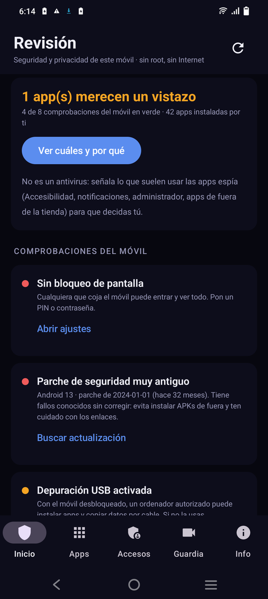
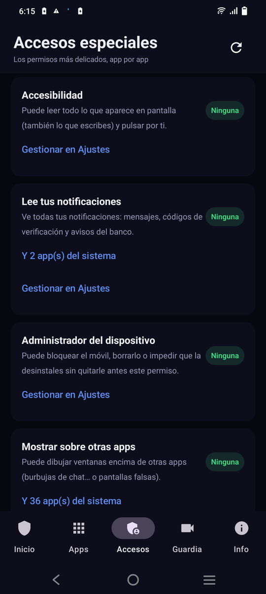
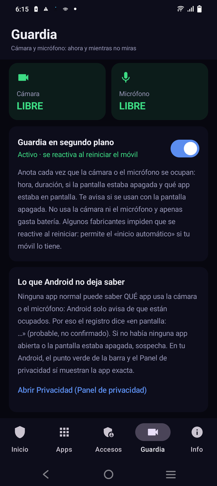

# AndroidSecurity

**Revisión de seguridad y privacidad para Android: sin root, sin Internet y sin cuentas.**

Parte de la suite **[OptiSuite](https://optisuite.app)** · por Enmanuel Gil (EnMaNueL-G) · licencia MIT

> ⚠️ **Si tienes la 1.0/1.1, desinstálala antes.** Aquellas versiones se publicaron firmadas con una clave
> de depuración; la 1.2.0 va firmada con la clave de OptiSuite y Android no deja instalarla encima.

<p>
  
  
  
</p>

## Qué hace

| Pestaña | Qué verás |
|---|---|
| **Inicio** | Comprobaciones del móvil: bloqueo de pantalla, antigüedad del parche de seguridad, señales de root, depuración USB, certificados instalados por el usuario, VPN y apps que no vienen de una tienda. Cuántas de tus apps pueden usar la cámara, el micrófono, la ubicación, contactos, SMS… |
| **Apps** | Permisos **concedidos de verdad** (no solo pedidos). Filtros: *Revisar*, *Sin usar* (apps que no abres hace más de 90 días y siguen con permisos), *Fuera de tienda*, y por permiso. Cada app explica **por qué** se señala y tiene botones para ir a sus permisos o desinstalarla. |
| **Accesos** | Los accesos especiales, app por app: Accesibilidad, lectura de notificaciones, administrador del dispositivo, mostrar sobre otras apps, instalar apps, datos de uso, todos los archivos y sin restricciones de batería. También los códigos del operador para comprobar desvíos de llamadas. |
| **Guardia** | Estado **en vivo** de cámara y micrófono (libre / en uso / linterna / silenciado) y, si lo activas, un registro en segundo plano con hora, duración, si la pantalla estaba apagada y qué app estaba en pantalla. Avisa si se usan con la pantalla apagada. Se reactiva al reiniciar el móvil. |

Se señalan como **«Revisar»** las combinaciones que usan las apps espía: Accesibilidad o administrador en
una app que no viene de una tienda, Accesibilidad junto con lectura de notificaciones, SMS + ubicación
siempre… Las apps del sistema se muestran aparte y **no se puntúan**.

## Límites (lo que ninguna app puede hacer sin root)

- **Saber qué app usa la cámara o el micrófono.** Android solo avisa de que están ocupados. El registro
  anota la app que estaba en pantalla (probable, no confirmado). En Android 12+ el punto verde de la barra
  y el Panel de privacidad del sistema sí muestran la app exacta.
- **Quitar permisos por ti:** la app te lleva a la pantalla de Ajustes donde lo haces tú.
- **Garantizar que no hay root o una app espía bien oculta.** No es un antivirus.
- **Ver otros perfiles** (perfil de trabajo, Island, apps duplicadas): solo analiza el perfil donde está instalada.

## Privacidad

- **Sin permiso de Internet** (bloqueado en el manifiesto), sin anuncios, sin cuentas y **sin copia en la nube**.
- El registro del guardia se guarda solo en el móvil y se puede borrar.

| Permiso | Para qué |
|---|---|
| `QUERY_ALL_PACKAGES` | Ver las apps instaladas y sus permisos (el objetivo de la app). |
| `PACKAGE_USAGE_STATS` | Lo concedes tú en Ajustes: apps sin usar y app en pantalla en el guardia. |
| `ACCESS_NETWORK_STATE` | Saber si hay una VPN activa. |
| `REQUEST_DELETE_PACKAGES` | Botón «Desinstalar» (Android siempre pide confirmación). |
| `FOREGROUND_SERVICE(_SPECIAL_USE)`, `POST_NOTIFICATIONS`, `RECEIVE_BOOT_COMPLETED` | El guardia en segundo plano, su notificación y reactivarlo al encender. |

## Descarga

[**AndroidSecurity.apk**](https://github.com/EnMaNueL-G/AndroidSecurity/releases/latest/download/AndroidSecurity.apk) · Android 8 o superior.

## Compilar

```bash
./gradlew assembleRelease
```

JDK 17+ (el de Android Studio sirve). La firma se lee de `keystore.properties`, que no está en el repositorio;
sin él se genera un APK sin firmar.

## Apoya el proyecto

- **Binance Pay ID:** `1165745950`
- **USDT (BSC · BEP-20):** `0xb6f6731a4ea87f8e1fd6f44f48b5bc4204571f08`

Solo son válidos estos datos.

— Web: **https://optisuite.app** · Soporte: **support@optisuite.app**
